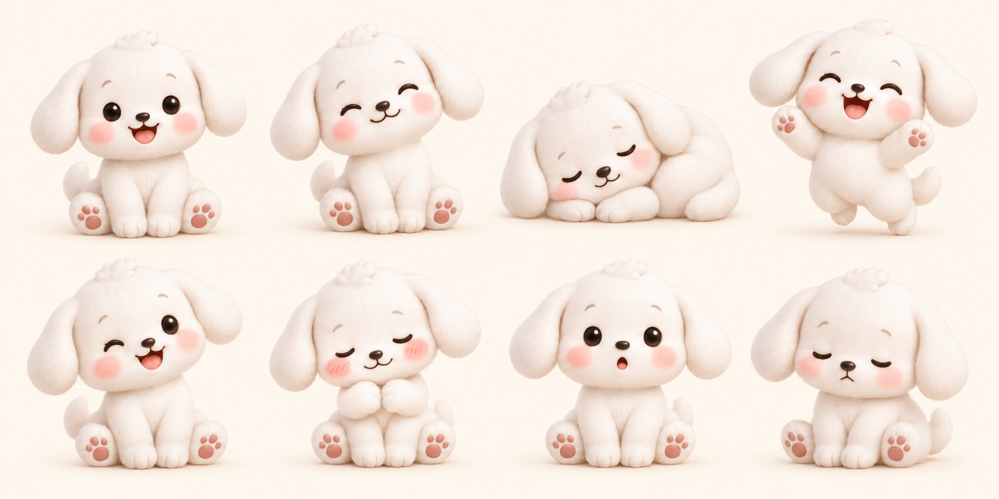
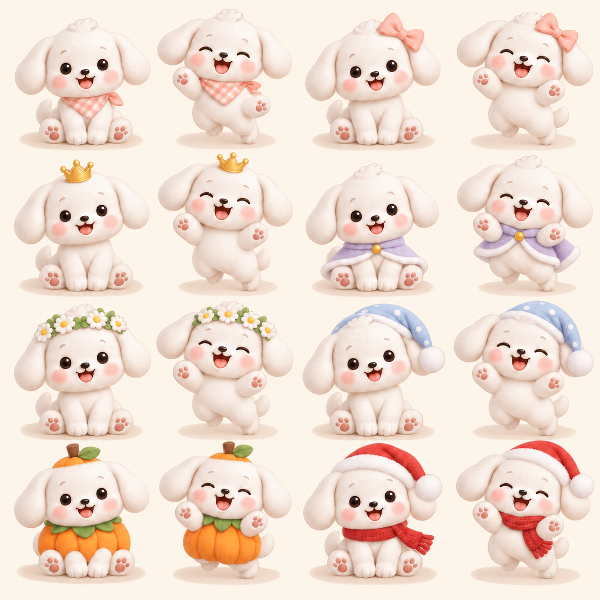
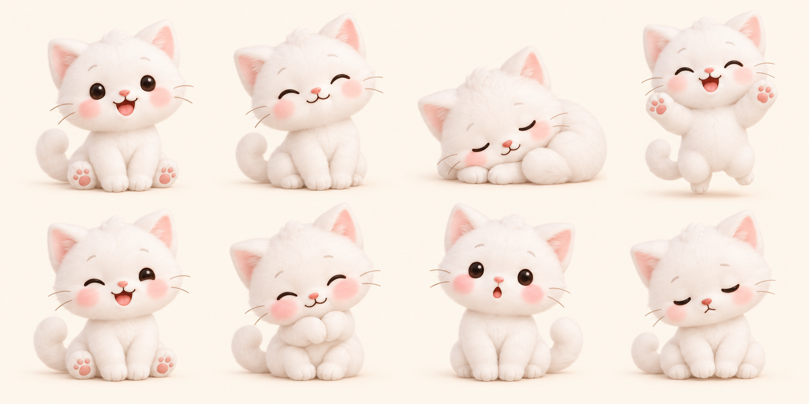
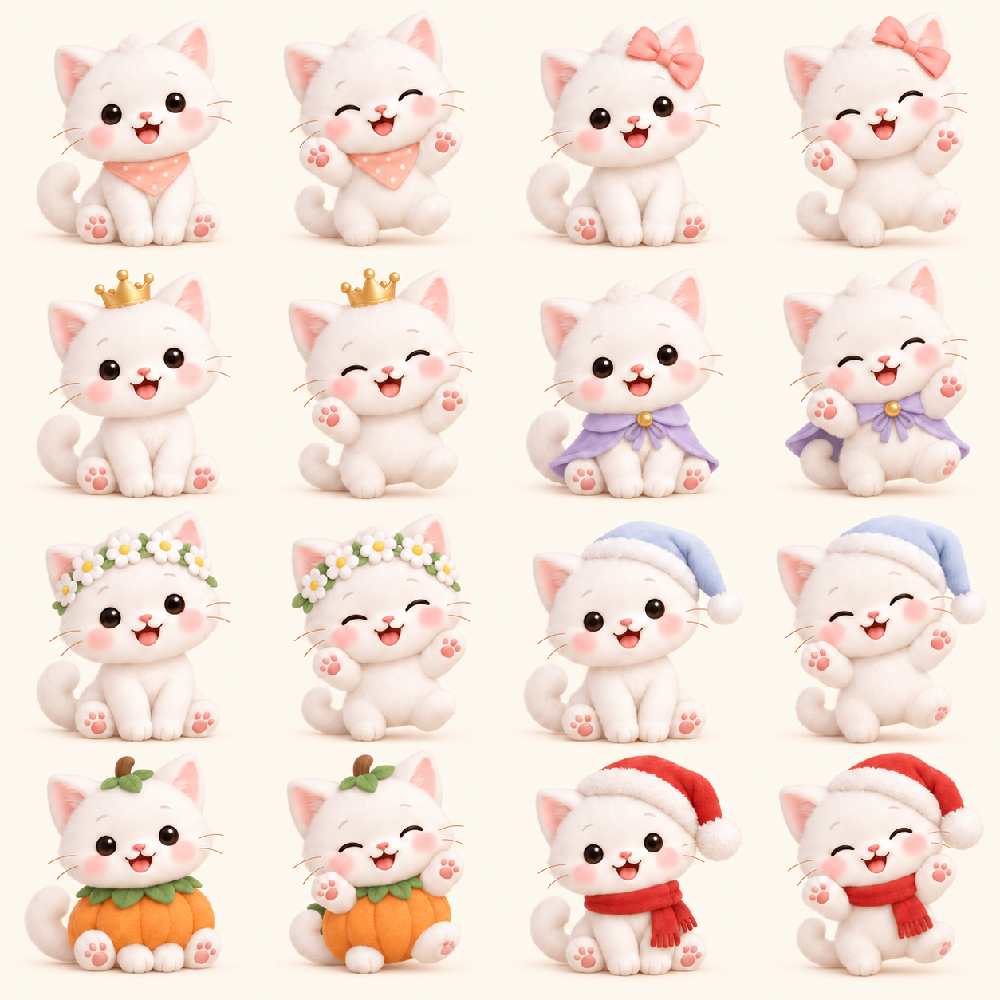
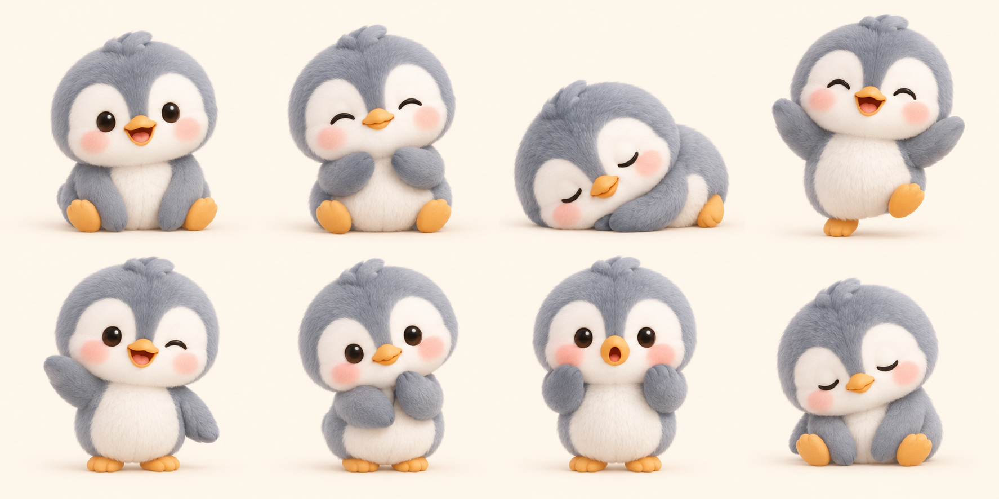
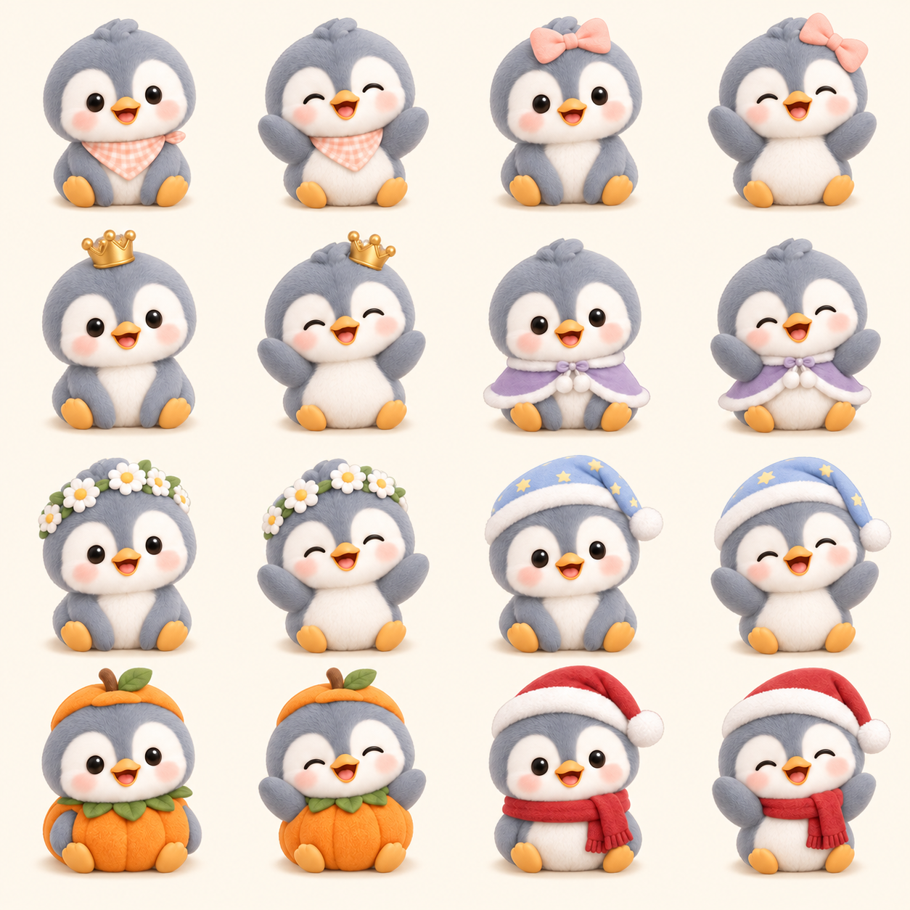

# 相棒のデザインと差分

## 基準

デザインの原本は `packages/mochi-assets/assets/puppy.png`（元の `public/puppy.png` と同一）。白いふわふわの毛、大きな丸い頭、たれ耳、つやのある丸い目、桃色のほっぺ、小さな手足を維持する。猫は耳・鼻・ひげ・しっぽ、ペンギンは青灰色の背中・白い顔とお腹・くちばし・フリッパーで種を表現し、同じぬいぐるみの世界にそろえる。

参考: [AlexaHelth/mochi-sabun-gazoan](https://github.com/AlexaHelth/mochi-sabun-gazoan) の README と衣装一覧（参照時 tree `4614b9866d42830bae3b2278e8ec37a47390bea4`）。表情・動物・衣装のアイデアだけを採用し、同リポジトリの画像・SVG・描画コードは転載していない。元の子犬画像を画像生成の参照入力にして、新たに描いた。

## 収録

3種 × 基本8表情 = 24状態。3種 × 衣装8種 × 2表情 = 48状態。合計72状態。
犬の基本0〜3は元画像を使い続けるため、新しい犬の表情シートの同セルは予備。

| シート | 列×行 | 使い方 |
| --- | --- | --- |
| `public/puppy.png` | 2×2 | 犬の基本0〜3。原本を保持 |
| `packages/mochi-assets/assets/{dog,cat,penguin}-expressions.png` | 4×2 | 基本表情。左上から行優先 |
| `packages/mochi-assets/assets/{dog,cat,penguin}-wardrobe.png` | 4×4 | 8衣装×通常・よろこびのペア |

基本表情: 0 にっこり / 1 うっとり / 2 すやすや / 3 ばんざい / 4 ウインク / 5 てれちゃう / 6 びっくり / 7 ひとやすみ。

| 衣装 | 必要な累計のおほしさま | 衣装シートのセル（0起点） |
| --- | ---: | --- |
| バンダナ | 5 | 0, 1 |
| リボン | 12 | 2, 3 |
| 王冠 | 20 | 4, 5 |
| マント | 30 | 6, 7 |
| 花かんむり | 40 | 8, 9 |
| ナイトキャップ | 55 | 10, 11 |
| かぼちゃ | 70 | 12, 13 |
| サンタ | 90 | 14, 15 |

衣装着用時の基本1・3・4・5はよろこび差分、それ以外は通常差分へ対応づける。すべての衣装×8表情を収録しているわけではない。CSS背景位置で各セルを表示し、元画像は加工しない。

## 保存と互換性

`profiles.settings` の既存JSONに `species`, `outfit`, `onboardingComplete` を追加。DBスキーマの変更なし。
新規プロフィールも記録もない場合だけ選択画面を出す。既存プロフィール・記録があれば犬を引き継ぐ。旧クライアントの設定更新でも新しい項目を失わない。サーバーで種類・衣装の列挙値と解放条件を検証。着替えや種類変更で星・記録は変化しない。

## 検証

`node tests/auth-storage.cjs` は初回選択、旧プロフィール・記録の引き継ぎ、旧クライアント互換、衣装解放境界、保存後の再取得、種類変更時のデータ維持、ユーザー分離、スプライトのセル範囲を実際のAPIハンドラーで確認する。画像は別途全シートを目視確認。ブラウザーでの実機操作確認は未実施。

## 画像一覧

### こいぬ

### こねこ

### ペンギン

共通化の理由と別リポジトリへの移行方法は [もち共通素材](../packages/mochi-assets/README.md)、最初の検証目標は [スマホ確認](smartphone-pilot.md) を参照。
